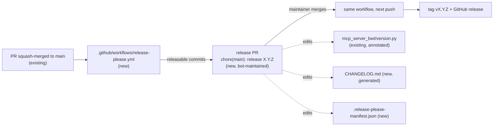

# Automated releases with release-please

Refs #16

## 📝 TLDR

The maintainer cuts releases by hand, and in practice doesn't: the only tag is `v0.1.0` (2025-04-08) even though several `fix:` commits have landed since. **Proposed:** a release-please GitHub Actions workflow keeps one release PR open, built from the Conventional Commit titles on `main`. Merging it bumps `mcp_server_bwt/version.py`, updates a generated `CHANGELOG.md`, tags `vX.Y.Z`, and publishes a GitHub release. Nothing about the server, its tools, or how it is launched changes.

## 📝 Problem Statement

- `git log v0.1.0..main` lists seven commits, four of them `fix:`/`fix(deps):` (#13, #17, `6e14683`), and `version.py` still reads `0.1.0`. So `uv build` produces `mcp_server_bwt-0.1.0` for code that differs from the tagged `0.1.0`.
- There is no `CHANGELOG.md`, so neither the maintainer nor users pinning `uvx --from git+…@<tag>` can see what changed between versions.
- The history already fits release-please: the repo squash-merges with `COMMIT_OR_PR_TITLE`, and recent PR titles follow Conventional Commits.

## 📝 Proposed Solution

Adopt [release-please](https://github.com/googleapis/release-please-action) in manifest mode, running on every push to `main`.

Alternatives considered:

- **python-semantic-release**: releases straight from `main` on every push, with no review step, and needs a commit-back or PAT. release-please's release PR gives the maintainer a merge button and a place to review the changelog, which fits the existing PR-centric SDLC.
- **Manual tags plus `om-auto-update-changelog`**: this is the process today, and it isn't being used. It stays available for ad-hoc changelog drafting, but release-please becomes the release mechanism.
- **Changesets / towncrier**: both need a fragment file per PR. The PR titles already carry the information, so that is extra authoring for no gain.

Market-leader check: release-please's `python` strategy updates `pyproject.toml` `[project].version` and a lowercase `__version__` in the package's `__init__.py`/`version.py`. This repo uses neither shape: `project.version` is dynamic, hatch reads `mcp_server_bwt/version.py`, and the symbol is uppercase `__VERSION__`. The strategy's built-in updaters therefore won't touch the real version source. The `generic` extra-file updater with an `x-release-please-version` line annotation is release-please's documented escape hatch for this case, and it is the one used here.

## 📝 Architecture

All new pieces are repository/CI config. No runtime code changes.

Takeaway: the only human action in a release is merging the bot's PR. Hatch keeps reading the version from the same file it reads today.

Files:

| File | Change |
|---|---|
| `.github/workflows/release-please.yml` | New. `on: push: branches: [main]`, `permissions: contents: write, pull-requests: write` (the repo's default workflow token is read-only), one job running `googleapis/release-please-action@v4` with `token: ${{ secrets.RELEASE_PLEASE_TOKEN \|\| github.token }}` (see A1). |
| `release-please-config.json` | New. One package `"."`: `release-type: python`, `package-name: mcp-server-bwt`, `include-component-in-tag: false` (tags stay `vX.Y.Z`, matching `v0.1.0`), `bump-minor-pre-major: true`, `extra-files: [{ "type": "generic", "path": "mcp_server_bwt/version.py" }]`. |
| `.release-please-manifest.json` | New. `{ ".": "0.1.0" }`, so release-please anchors on the existing `v0.1.0` release. |
| `mcp_server_bwt/version.py` | `__VERSION__ = "0.1.0"  # x-release-please-version`. Hatch's default version pattern is case-insensitive and stops at the closing quote, so the trailing comment doesn't affect parsing. This is verified with `uv build` in step 1.2. |
| `CHANGELOG.md` | Not hand-written. release-please creates it in the first release PR. |
| `AGENTS.md`, `SDLC.md`, `BACKWARD_COMPATIBILITY.md` | Docs, see Phase 2. |

Current consumers: users run the server from git HEAD (`uvx --from git+https://github.com/zizzfizzix/mcp-server-bwt`), so tags and releases don't change what they run. The package isn't on PyPI. #11 (validation CI) is independent. The interaction between the two is covered in Risks.

## 📝 API Contracts

The public contract is the commit-title convention, which contributors (human and agent) already follow:

| PR title | Effect while pre-1.0 (`bump-minor-pre-major`) |
|---|---|
| `fix: …` / `fix(scope): …` | patch bump, "Bug Fixes" section |
| `feat: …` | minor bump (`bump-patch-for-minor-pre-major` is not set), "Features" section |
| `feat!: …`, `fix!: …`, or a `BREAKING CHANGE:` footer | minor bump (major is held back pre-1.0) |
| `chore:`, `docs:`, `refactor:`, `test:`, `ci:`, `build:`, `style:` | no release PR on its own; hidden from the changelog |

Tag format: `vX.Y.Z`. Release PR title: `chore(main): release X.Y.Z`. Both are release-please defaults and are left as they are.

## 📝 Edge Cases & Failure Scenarios

- **Repo setting off:** *Actions → General → Allow GitHub Actions to create and approve pull requests* is currently disabled (`can_approve_pull_request_reviews: false`). The workflow then fails with `GitHub Actions is not permitted to create or approve pull requests`, and no release PR appears. This is a one-time maintainer action (A3). The workflow run shows the error. Nothing else breaks.
- **Only non-releasable commits since the last release:** release-please logs "no user facing commits" and opens no PR. This is intended.
- **Merge commits:** they are still allowed on the repo. A merge commit's own title (`Merge pull request #N …`) is not conventional and is ignored, while its branch commits are parsed individually. That still works, but the changelog becomes noisier. The recommendation (not in scope) is to disable merge commits.
- **Someone hand-edits `version.py`:** the manifest and the file disagree, and the next release PR overwrites the file from the manifest. Guarded by the doc change in `BACKWARD_COMPATIBILITY.md`.
- **Workflow token cannot trigger other workflows:** release PRs opened with `GITHUB_TOKEN` don't start other workflows (A1).
- **release-please fails to find `v0.1.0`:** the manifest version plus the existing GitHub release `v0.1.0` at `ddb78c7` is the anchor. If it can't be found, release-please would scan the full history and propose a larger changelog. This is visible in the release PR before merge, and fixed by adding `bootstrap-sha: ddb78c7…` to the config.

## 📝 Risks & Impact Review

- **Blast radius:** CI config and one comment on the version line. No protected surface in `BACKWARD_COMPATIBILITY.md` changes: package identity, console script, tools, schemas and env vars are untouched.
- **Rollback:** delete the workflow and both JSON files, and drop the annotation comment. Tags and releases already created stay, and they are harmless. An unwanted release is undone by deleting the GitHub release and tag and reverting the release PR commit.
- **Permissions:** the workflow gets `contents: write` + `pull-requests: write`, scoped to this one job. It runs only on `push` to `main`, never on `pull_request` from forks, so untrusted code never runs with the write token.
- **Supply chain:** the action is pinned to the `v4` major tag, as the issue specifies. SHA-pinning is stricter, but every Dependabot-less update would then be manual. Left as a maintainer choice, not a defect.
- **#11 interaction (direction call, not a defect):** once `validate` becomes a required check, a release PR opened with `GITHUB_TOKEN` never gets that check and can't merge. The `RELEASE_PLEASE_TOKEN` fallback (A1) lets the maintainer fix this by adding a secret, with no code change.

## 📝 Resolved assumptions (autonomous defaults)

| # | Question | Applied default | Why | Confirm? |
|---|---|---|---|---|
| A1 | Blocking in the issue: which token opens release PRs, given that `GITHUB_TOKEN` PRs don't trigger other workflows? | `token: ${{ secrets.RELEASE_PLEASE_TOKEN \|\| github.token }}`: works today with the built-in token. When #11 adds a required check, the maintainer adds a fine-grained PAT or App token as the `RELEASE_PLEASE_TOKEN` secret, with no code change. | There is no CI today (`.github/` doesn't exist), so nothing is blocked yet. The fallback is fully reversible and needs no secret to ship. | reversible |
| A2 | Publish to PyPI? | No. Out of scope. | The README installs from git, `mcp-server-bwt` isn't on PyPI, and publishing needs a trusted-publisher setup and a name claim. It can be added later as a job gated on `release_created`. | reversible |
| A3 | Enable "Allow GitHub Actions to create and approve pull requests"? | Required, but it is a **maintainer action** outside the PR. Automation doesn't change repo settings. | This is an admin setting on a shared repo, and the implementing run must not flip it silently. | reversible |
| A4 | First release: `0.1.1` or `0.2.0`? | Let the commits decide. There are only `fix:` commits since `v0.1.0`, which gives **0.1.1**. No `release-as` override. | This is the least surprising option and keeps SemVer honest. The maintainer can add `Release-As: 0.2.0` to a commit body if they prefer. | reversible |
| A5 | Disable merge commits? | No. Recommended in the docs, not changed. | It's a repo setting (same reasoning as A3), and release-please tolerates merge commits. | reversible |
| A6 | Backfill a changelog before `v0.1.0`? | No. | This is a non-goal in the issue. | reversible |
| A7 | Split into several specs? | No. | Config, workflow and docs make up one capability, and none of them works alone. | reversible |

## 📋 Phasing

- **Phase 1 — Release automation.** Config, manifest, workflow, and the version annotation. This can ship alone: after merge (plus A3), the release PR appears.
- **Phase 2 — Docs.** Tell contributors and agents how releases work, and stop telling them to hand-edit `version.py`. Ships in the same PR. It is split out only so each step stays reviewable.

## 📋 Implementation Plan

### Phase 1 — Release automation

1. **Add release-please config and manifest.** Create `release-please-config.json` (with `$schema` pointing at the release-please config schema) and `.release-please-manifest.json` exactly as in Architecture. *Test:* both parse as JSON (`python -m json.tool`). The config validates against the schema's required keys.
2. **Annotate the version line.** Append `  # x-release-please-version` to `__VERSION__` in `mcp_server_bwt/version.py`. *Test:* `uv build` produces `mcp_server_bwt-0.1.0`, and the full validation gate (ruff check, ruff format --check, mypy --strict, uv build) passes.
3. **Add the workflow.** Create `.github/workflows/release-please.yml` with the trigger, permissions and token expression from Architecture. *Test:* the YAML parses. If `actionlint` is available, it passes. A local check simulates the generic updater: replace the semver on the annotated line and confirm hatch still reads the new value (`uv build` into a scratch dir after a temporary edit that is reverted afterwards).

### Phase 2 — Docs

4. **AGENTS.md.** Add a *Releases* task-routing row: release-please owns `version.py`, `CHANGELOG.md` and tags; never hand-edit them; the PR title decides the bump. Update the *CI* row to say the release-please workflow exists, while validation CI is still TODO (#11). *Test:* `grep -n release-please AGENTS.md` shows both rows, and the CI row no longer says `none`.
5. **SDLC.md.** Right after the Merge row / post-merge paragraph, add a short "Releasing" note: merging the open `chore(main): release X.Y.Z` PR is how a release is made. Adjust the sentence that makes `om-auto-update-changelog` the changelog source, because release-please now generates it. *Test:* `grep -n 'chore(main): release' SDLC.md` matches the new note.
6. **BACKWARD_COMPATIBILITY.md.** Replace "Bump the minor version in `mcp_server_bwt/version.py`" (surfaces 1 and 3) with "mark the PR title breaking (`feat!:` / `BREAKING CHANGE:`) so release-please bumps the minor version". Also mention it in the intro. *Test:* `grep -n 'version.py' BACKWARD_COMPATIBILITY.md` no longer tells anyone to bump it by hand.

### Post-merge verification (maintainer, outside the PR)

- Enable the A3 setting, then re-run the workflow on `main`. A `chore(main): release 0.1.1` PR appears, bumping `version.py` and creating `CHANGELOG.md`.
- Merging it creates tag `v0.1.1` and a GitHub release, and `uv build` on the tag produces `mcp_server_bwt-0.1.1`.
- A later `docs:`-only merge opens no release PR.
