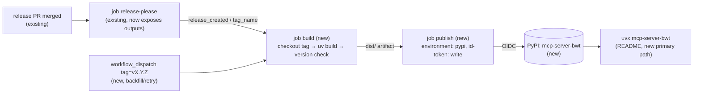

# Publish mcp-server-bwt to PyPI

## 📝 TLDR

Right now users can only run the server from git HEAD (`uvx --from git+https://github.com/zizzfizzix/mcp-server-bwt mcp-server-bwt`). That means they get whatever is on `main`, even though release-please already cuts tagged versions. **Proposed:** every release that release-please creates is also built and uploaded to PyPI as `mcp-server-bwt`, using PyPI Trusted Publishing (OIDC, so no stored token). The README, AGENTS.md, SDLC.md, BACKWARD_COMPATIBILITY.md and CODE_REVIEW.md then describe `uvx mcp-server-bwt` as the install path. The server code doesn't change.

Before the first upload can succeed, a maintainer has to make two one-time settings outside the repo (PyPI pending publisher, GitHub `pypi` environment). See **Maintainer actions**.

## 📝 Problem Statement

- `curl https://pypi.org/pypi/mcp-server-bwt/json` returns 404 (checked 2026-09-24). The name is unclaimed on PyPI and on TestPyPI, so anyone could register it first.
- Every README client config (Claude Desktop, Zed) uses `--from git+https://github.com/…`. Users get untagged `main`, a git clone on every cold start, and no way to pin a release other than a hand-written `@vX.Y.Z` git ref.
- Some repo docs already describe PyPI behavior that doesn't exist yet. `BACKWARD_COMPATIBILITY.md` says "users run it via `uvx mcp-server-bwt`, which picks up new releases", and AGENTS.md says the package is "published as the `mcp-server-bwt` console script". Both describe PyPI behavior.
- Release automation exists (#16, #22), and release PR #29 (`chore(main): release 0.2.0`) is open. Publishing is the missing last step. The release-please spec had explicitly deferred it (`2026-09-23-release-please.md`, A2).

## 📝 Proposed Solution

Add a build job and a publish job to the existing `.github/workflows/release-please.yml`. Both run only when release-please reports `release_created`. The publish job uploads with `pypa/gh-action-pypi-publish` through PyPI Trusted Publishing, inside a GitHub environment named `pypi`. Clean up `pyproject.toml` metadata so the PyPI project page is correct, limit the sdist to what a source build needs, and rewrite the install docs around `uvx mcp-server-bwt`.

Alternatives considered:

- **API token in a repo secret (`PYPI_API_TOKEN`)**: a long-lived credential that has to be rotated and can leak. PyPI and the PyPA both recommend Trusted Publishing for GitHub Actions. It needs no secret, and it automatically generates PEP 740 attestations.
- **Separate `publish.yml` on `release: published`**: this is fragile here. The release event fires only when the release was created with a PAT/App token, not with `GITHUB_TOKEN`, and `release-please.yml` falls back to `github.token`. Chaining off `release_created` in the same workflow works whichever token created the release. Trusted Publishing binds to one workflow filename, and keeping everything in `release-please.yml` leaves one file to register.
- **`uv publish`**: it supports Trusted Publishing too, but it doesn't generate attestations. The PyPA action is the reference implementation.
- **Publish on every push to `main` (dev versions)**: no. Versions come only from release-please.

Market-leader check: the reference MCP servers (`mcp-server-fetch`, `mcp-server-git` in `modelcontextprotocol/servers`) publish to PyPI and document a plain `uvx mcp-server-<name>` as the primary install. The MCP Registry (`server.json` + `mcp-publisher`) is increasingly common too, but it builds on a PyPI package that already exists, so it's deferred (A7).

## 📝 Architecture

All the changes are packaging config, CI and docs. `mcp_server_bwt/` is not touched.

Takeaway: merging the release PR stays the only routine human action. PyPI trusts exactly one workflow file in one repo, and only for jobs running in the `pypi` environment.

### Workflow changes (`.github/workflows/release-please.yml`)

| Element | Change |
|---|---|
| Triggers | Keep `push: branches: [main]`. Add `workflow_dispatch` with a required string input `tag` (for example `v0.2.0`) for a backfill or a retry after a failed upload. |
| Permissions | Move from workflow-level to job-level. `release-please`: `contents: write, pull-requests: write` (same as today). `build`: `contents: read`. `publish`: `id-token: write` only. The OIDC permission never shares a job with repo write access. |
| `release-please` job | `if: github.event_name == 'push'`. Give the action step `id: release` and expose `release_created` and `tag_name` as job outputs. The manifest package is `"."`, and v4 emits root-path outputs without the `<path>--` prefix (`setPathOutput` in the action's `src/index.ts`), so the names are exactly `release_created` and `tag_name`. Token, config and manifest stay unchanged. |
| `build` job (new) | `needs: release-please`, `if: always() && (needs.release-please.outputs.release_created == 'true' \|\| github.event_name == 'workflow_dispatch')`. `actions/checkout@v7` with `ref: ${{ inputs.tag \|\| needs.release-please.outputs.tag_name }}` and `persist-credentials: false`. Set up setup-uv pinned to the same SHA as `ci.yml`, then `uv build`. **Version guard:** strip the leading `v` from the tag and fail unless `dist/mcp_server_bwt-${VERSION}-py3-none-any.whl` and `dist/mcp_server_bwt-${VERSION}.tar.gz` both exist. This stops a mistyped dispatch tag or a missed `version.py` bump before it reaches PyPI. Upload `dist/` with `actions/upload-artifact` (name `dist`). |
| `publish` job (new) | `needs: build`, `environment: { name: pypi, url: https://pypi.org/p/mcp-server-bwt }`, `permissions: id-token: write`. Download the `dist` artifact to `dist/`, then run `pypa/gh-action-pypi-publish`, **pinned to the full commit SHA of the latest v1.x release** with a `# vX.Y.Z` comment (same convention as setup-uv in `ci.yml`). No `with:` inputs: Trusted Publishing and attestations are its defaults. |

`workflow_dispatch` runs on the default branch's copy of the workflow and checks out the given tag. That lets a tag that predates this workflow (for example `v0.2.0`, if #29 merges first) be published too.

### Packaging changes (`pyproject.toml`)

| Field | Change | Why |
|---|---|---|
| `license` | `license = "MIT"` (PEP 639 SPDX expression) plus `license-files = ["LICENSE"]`. **Remove** the `License :: OSI Approved :: MIT License` classifier. | PEP 639 disallows combining a license expression with license classifiers. The expression form builds with the current hatchling (checked in a scratch copy on 2026-09-24). |
| `classifiers` | Add `Programming Language :: Python :: 3.13`, `Development Status :: 4 - Beta`, `Intended Audience :: Developers`, `Topic :: Internet :: WWW/HTTP :: Indexing/Search`. Keep `Programming Language :: Python :: 3` and `Operating System :: OS Independent`. | Filters and the project sidebar on PyPI. |
| `keywords` | `["mcp", "model-context-protocol", "bing", "bing-webmaster-tools", "seo"]` | Search on PyPI. |
| `[project.urls]` | `Homepage`/`Repository` = `https://github.com/zizzfizzix/mcp-server-bwt`, `Issues` = `…/issues`, `Changelog` = `…/blob/main/CHANGELOG.md` | Sidebar links. |
| `[tool.hatch.build.targets.sdist]` | `include = ["mcp_server_bwt/", "README.md", "LICENSE", "pyproject.toml"]`. `CHANGELOG.md` is added when it exists (hatch skips missing include paths). | Today the sdist ships `.ai/` (specs, run plans, tracker descriptors), `AGENTS.md`, `SDLC.md`, `lefthook.yml`, `uv.lock` and the workflows. Checked by building `origin/main` in a scratch copy on 2026-09-24. None of that is needed to build the package. |
| `[tool.hatch.build.targets.wheel]` | Add `exclude = ["mcp_server_bwt/test_*.py"]`. | The wheel currently installs `test_packaging.py`, `test_service.py` and `test_startup.py` into users' environments. The tests still run from the repo checkout. |

`name`, `requires-python`, `dependencies`, `[project.scripts]` (both `mcp-server-bwt` and `mcp_server_bwt`) and the hatch version source don't change. `authors` stays name-only, so no email address is published.

### Docs changes

| File | Change |
|---|---|
| `README.md` | Add PyPI version and Python-version badges under the title. **Requirements:** drop Python ≥ 3.13 as a user prerequisite (uvx provisions it) and keep it under Development. Say that Node.js is only needed for `make mcp_inspector`. **Installation → Using uvx (recommended):** client configs become `"command": "uvx", "args": ["mcp-server-bwt"]` with the `env` block, for Claude Desktop and Zed. Add a Claude Code one-liner (`claude mcp add bwt -e BING_WEBMASTER_API_KEY=… -- uvx mcp-server-bwt`) and Cursor (`.cursor/mcp.json`, same JSON shape). Add a short **Versions and upgrades** note: pin with `"args": ["mcp-server-bwt@0.2.0"]`, and use `uvx mcp-server-bwt@latest` (or `uv cache clean mcp-server-bwt`) to pick up a new release, because uvx reuses its cached environment. Add a **Running unreleased `main`** subsection that keeps the current `--from git+https://…` form as a secondary option. **Using make** stays as it is. |
| `mcp_server_bwt/test_packaging.py` | `test_readme_json_snippets_parse_and_uvx_snippets_pass_the_key` counts exactly two uvx configs. Update it to count every uvx config (Claude Desktop, Zed, Cursor, plus the git one if that subsection uses JSON), and keep asserting that each one passes `BING_WEBMASTER_API_KEY` and ends with `mcp-server-bwt`. |
| `AGENTS.md` | Overview: "published to PyPI as `mcp-server-bwt`". **Releases** row: merging the release PR also builds and uploads to PyPI through the `publish` job in the `pypi` environment. Never add a PyPI token secret. Backfill or retry with `gh workflow run release-please.yml -f tag=vX.Y.Z`. **Dependencies and packaging** row: the sdist `include` list and the wheel test exclude, and the fact that PyPI releases are immutable. **CI** row: mention the build/publish jobs. **Docs** row: README install paths now start from PyPI. |
| `SDLC.md` | *Releasing*: merging the release PR also publishes `mcp-server-bwt` to PyPI. Add a failed-upload recovery line (re-run the failed job, or dispatch with the tag). A bad release is **yanked**, never deleted or re-uploaded, and fixed forward with a new patch release. |
| `BACKWARD_COMPATIBILITY.md` | Intro: users run released versions from PyPI via `uvx mcp-server-bwt`, which resolves the newest release on a cold cache or with `@latest`. Surface 6 *Package identity*: add the PyPI project `mcp-server-bwt`. A published version can't be replaced (only yanked), so a breaking change that reaches PyPI can't be recalled. Surface 3: `requires-python` changes now also affect resolver behavior for existing PyPI users. |
| `CODE_REVIEW.md` | One rule: changes to the `build`/`publish` jobs keep `id-token: write` scoped to `publish`, keep `environment: pypi`, keep the SHA pin on `pypa/gh-action-pypi-publish`, and never introduce a PyPI token secret. |

## 📝 API Contracts

The new public contract is the PyPI project `mcp-server-bwt`:

- One PyPI version per release-please tag `vX.Y.Z`, with the version string equal to the tag minus `v`, and both an sdist and a `py3-none-any` wheel.
- The console scripts `mcp-server-bwt` and `mcp_server_bwt` → `mcp_server_bwt.main:app` (unchanged, surface 3).
- The manual entry point `gh workflow run release-please.yml -f tag=vX.Y.Z` builds and publishes an existing tag. PyPI rejects a re-upload of an existing version, so running it twice is safe: the second run fails at upload.

## 📝 Edge Cases & Failure Scenarios

| Scenario | What happens | Recovery |
|---|---|---|
| The pending publisher isn't registered, or its fields don't match (owner, repo, workflow filename, environment) | `publish` fails with `invalid-publisher`. The tag and GitHub release already exist. | Fix the PyPI publisher, then **re-run failed jobs** on that workflow run, or dispatch with the tag. |
| The `pypi` environment is missing | GitHub auto-creates it with no protection rules, and the OIDC claim still carries `environment: pypi`, so the upload works. | Create it with the protection rules below (maintainer action 2). |
| Environment has required reviewers | `publish` waits for approval. The release PR merge still completes. | Approve the deployment in the Actions run. Unapproved runs time out after 30 days. Dispatch later with the tag. |
| Release PR #29 merges before this lands | `v0.2.0` exists without a PyPI upload. | After this lands, run `gh workflow run release-please.yml -f tag=v0.2.0`. |
| Someone else registers `mcp-server-bwt` first | A pending publisher doesn't reserve the name. The first upload fails with a 403. | Register the pending publisher and ship the first release promptly (maintainer action 1). If the name is lost, rename, which is a protected-surface change (surface 6) and needs its own decision. |
| Dispatch with a tag whose `version.py` differs | The version guard in `build` fails before anything is uploaded. | Use the correct tag. |
| A release is broken on PyPI | The version can't be replaced. | Yank it on PyPI (`uvx` and pip skip yanked versions unless they're pinned exactly), then fix forward with `fix:` → patch release. |
| `release-please` job fails | `build` sees no `release_created` and is skipped. `always()` only keeps the dispatch path alive. | Same as today: re-run. |
| A fork PR or non-main ref | The workflow only triggers on push to `main` and on dispatch (write access required). The environment's deployment-branch rule limits `publish` to `main`, and PyPI's OIDC check limits it to this repo and file. | none needed |

## 📝 Risks & Impact Review

- **Irreversible by design:** the first upload permanently claims the name and publishes `0.2.0` (or whichever version comes first). PyPI versions can't be overwritten. Yank plus patch is the only way to undo a release, and that belongs in SDLC.md.
- **Supply chain:** the upload credential is a short-lived OIDC token, minted only in the `publish` job, only in the `pypi` environment, and only for `zizzfizzix/mcp-server-bwt` + `release-please.yml`. The action is pinned by SHA. Attestations let users verify provenance. There's no long-lived secret to leak.
- **Upgrade semantics for users:** a plain `uvx mcp-server-bwt` resolves the latest release on first use, then reuses its cache. That's a softer "auto-update" than the current git-HEAD behavior, and the BACKWARD_COMPATIBILITY.md intro must say so accurately rather than overstate it.
- **Breaking-change timing:** draft PR #41 (`feat(tools)!: bound list tool results…`) is breaking. If it merges before the first PyPI release, the first PyPI users start on the new behavior, which is fine. If it merges after, it ships as a minor bump under the existing policy. No new policy is needed.
- **Existing git-based users** are unaffected: the `--from git+…` form keeps working and stays documented.
- **Rollback of the change itself:** reverting the workflow jobs stops future uploads. Versions already published stay on PyPI.

## 📝 Maintainer actions (humans, outside the PR)

These have to be done by a person with the right accounts. Automation doesn't change PyPI or repo settings.

1. **PyPI: register a pending Trusted Publisher.** Sign in at pypi.org (create an account with 2FA if needed) → *Your account → Publishing → Add a new pending publisher → GitHub*:
   - PyPI project name: `mcp-server-bwt`
   - Owner: `zizzfizzix`
   - Repository name: `mcp-server-bwt`
   - Workflow name: `release-please.yml`
   - Environment name: `pypi`

   A pending publisher does **not** reserve the name, so do this right before the first release goes out.
2. **GitHub: create the `pypi` environment.** *Repo Settings → Environments → New environment* `pypi`. Under *Deployment branches and tags*, pick **Selected branches** → `main`. Use `main`, not a tag pattern: GitHub checks the workflow run's ref (`github.ref`), not what the job checks out. Both the release push and the manual dispatch run on `refs/heads/main`, so a tags-only rule would block every upload. Limiting the environment to `main` also means only the reviewed copy of `release-please.yml` on `main` can reach PyPI. Optionally add yourself as a **Required reviewer** to get a manual approval before every upload (recommended for the first release). The environment needs no secrets.
3. **Keep `RELEASE_PLEASE_TOKEN` set** (already required, see AGENTS.md → CI). Nothing new here.
4. **Pick the first PyPI version.** The simplest path is to merge this implementation **before** release PR #29, so `0.2.0` is the first release that gets uploaded. If #29 has already merged, run `gh workflow run release-please.yml -f tag=v0.2.0` once this lands.
5. **After the first upload:** check https://pypi.org/p/mcp-server-bwt (README renders, sidebar links, the MIT license, and the attestation shown on the file). Smoke-test with `BING_WEBMASTER_API_KEY=… uvx mcp-server-bwt@latest` from a client. Optionally add a second PyPI owner or maintainer so the project isn't tied to one account.
6. **Optional later:** list the server in the MCP Registry (A7).

## 📝 Resolved assumptions (autonomous defaults)

| # | Question | Applied default | Why | Confirm? |
|---|---|---|---|---|
| A1 | How does CI authenticate to PyPI? | Trusted Publishing (OIDC) through `pypa/gh-action-pypi-publish`. No token secret. | No long-lived credential, attestations for free, and the PyPA-recommended path. | reversible |
| A2 | Where does the publish job live? | In `release-please.yml`, gated on `release_created`, plus `workflow_dispatch` for a backfill. | It works whichever token created the release, and Trusted Publishing binds to one filename. | reversible |
| A3 | Rehearse on TestPyPI first? | No. There's no TestPyPI job. The version guard and the PyPA action's metadata check cover the risky parts, and an optional environment reviewer gates the first upload. | A TestPyPI job needs a second publisher and environment for a one-time benefit. | reversible |
| A4 | Manual approval before every upload? | Not enforced in code. The maintainer can add required reviewers to the `pypi` environment (recommended for the first release). | It's a repo setting, not a code decision, and it can be toggled any time. | reversible |
| A5 | Which version goes to PyPI first? | Whatever releases first after this merges. The recommended order is this PR, then #29 (`0.2.0`). The dispatch backfill covers the other order. | No `release-as` override, and SemVer stays commit-driven. | reversible |
| A6 | Keep the git-based install in the README? | Yes, as a secondary "Running unreleased `main`" subsection. | Existing users' configs keep working, and contributors can test unreleased fixes. | reversible |
| A7 | Also publish to the MCP Registry (`server.json`)? | No. Deferred to a follow-up. | It needs an existing PyPI package and a namespace/ownership check. It's a separate capability. | reversible |
| A8 | Attach built dists to the GitHub release too? | No. | PyPI is the distribution channel, and attestations already give provenance. | reversible |
| A9 | Split into a publishing spec and a docs spec? | No. One spec, two phases. | Docs pointing at `uvx mcp-server-bwt` are false until publishing works, and publishing without the docs leaves users on git. | reversible |
| A10 | Exclude tests from the wheel and restrict the sdist? | Yes. | Smaller artifacts, no repo-internal process files published. It doesn't affect how the repo's tests run. | reversible |

## 📋 Phasing

- **Phase 1 — Packaging and publish pipeline.** `pyproject.toml` metadata and build targets, plus the workflow jobs. Once the maintainer actions are done, the next release lands on PyPI.
- **Phase 2 — Docs.** README, test update, AGENTS.md, SDLC.md, BACKWARD_COMPATIBILITY.md, CODE_REVIEW.md. Ships in the same PR, so the docs never describe a path that doesn't exist.

## 📋 Implementation Plan

### Phase 1 — Packaging and publish pipeline

1. **Metadata.** Apply the `license`/`license-files`/classifier/`keywords`/`[project.urls]` changes. *Test:* `uv build`, then `uvx twine check --strict dist/*` passes. `unzip -p dist/*.whl '*/METADATA'` shows `License-Expression: MIT`, the `Project-URL` lines, and no `License ::` classifier.
2. **Build targets.** Add the sdist `include` and the wheel `exclude`. *Test:* `tar tzf dist/*.tar.gz` lists only `mcp_server_bwt/**`, `README.md`, `LICENSE`, `pyproject.toml`, `PKG-INFO` (plus `CHANGELOG.md` if present). `unzip -l dist/*.whl` has no `test_*.py`. `pip install dist/*.whl` into a scratch venv and `BING_WEBMASTER_API_KEY=dummy mcp-server-bwt` starts (exits on stdin EOF). The full validation gate passes.
3. **Workflow.** Restructure `release-please.yml` as described in Architecture (job-level permissions, outputs, `build` with the version guard, `publish` in the `pypi` environment, `workflow_dispatch` with `tag`). *Test:* `actionlint` passes when available, and the YAML parses. Extract the guard script and run it locally with a matching and a mismatching `VERSION` against a local `uv build`: it passes and fails respectively. There's no live upload in CI for this PR, since the jobs only run on a release or a dispatch.

### Phase 2 — Docs

4. **README + packaging test.** Rewrite Requirements and Installation as described in Docs changes, and update `test_packaging.py` to match. *Test:* `BING_WEBMASTER_API_KEY=dummy uv run pytest mcp_server_bwt` passes. Every JSON snippet parses, and every uvx config passes the key.
5. **AGENTS.md, SDLC.md, BACKWARD_COMPATIBILITY.md, CODE_REVIEW.md.** Apply the table in Docs changes. *Test:* `grep -n -i pypi AGENTS.md SDLC.md BACKWARD_COMPATIBILITY.md CODE_REVIEW.md` shows each new passage, and `grep -n 'yank' SDLC.md` matches the recovery note.

### Post-merge verification (maintainer)

- Do maintainer actions 1–2, then merge the next release PR (or dispatch with the tag). `publish` goes green, and https://pypi.org/p/mcp-server-bwt shows the version with an attestation.
- `uvx mcp-server-bwt@latest` starts from Claude Desktop with the README config.
